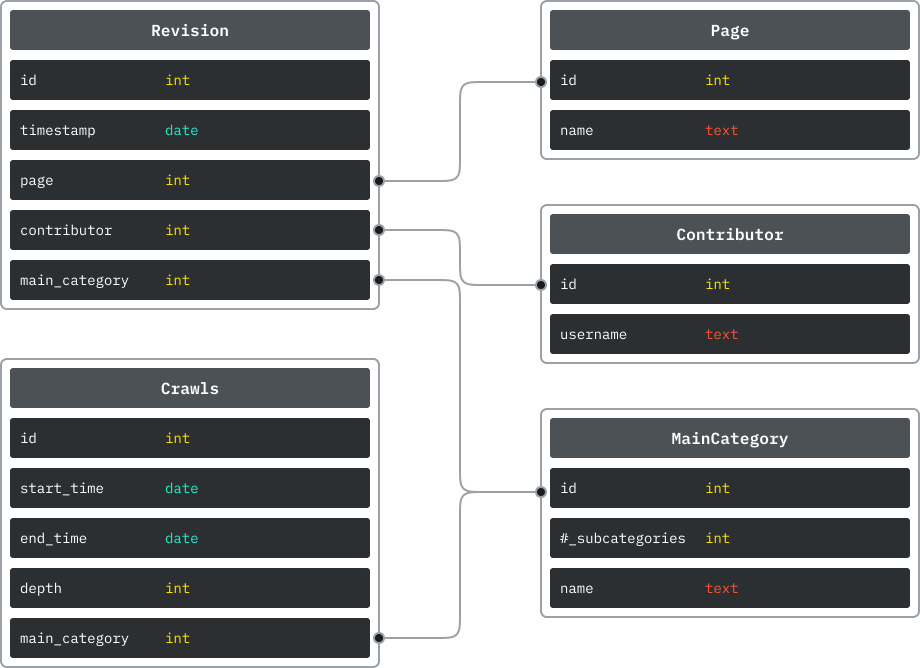

# Network Science Project HS2024

This repository is part of the final project of the Network Science course at the University of Zurich, autumn term 2024. We acquired data from Wikipedia, created different graphs and performed different analyses on these graphs. A detailed description of what we did, why we did it and the results can be found in the final report. A very short summary can be found in the [About](#about) section of this readme.

## Table of Contents

- [Network Science Project HS2024](#network-science-project-hs2024)
  - [Table of Contents](#table-of-contents)
  - [About](#about)
  - [Data](#data)
  - [Requirements and Installation](#requirements-and-installation)
  - [Usage](#usage)
  - [Features](#features)
    - [Data Acquisition](#data-acquisition)
    - [Data Analysis](#data-analysis)
  - [Acknowledgement](#acknowledgement)

## About
// Todo

## Data

The table below sows the main categories crawled and some key metrics for each main category. The following graphs show the evolution of some of these metrics over time for each category.

| Category                | Number of Subcategories | Number of Pages | Number of Contributors | Number of Revisions |
| ----------------------- | ----------------------- | --------------- | ---------------------- | ------------------- |
| Amiga CD32 games        | 2                       | 143             | 8013                   | 29370               |
| Game boy games          | 6                       | 167             | 8953                   | 30851               |
| Machine learning        | 61                      | 1548            | 75217                  | 273260              |
| Artificial intelligence | 109                     | 8695            | 610800                 | 29368               |

The generated graphs and the database file can be found here in this [Dropbox](https://www.dropbox.com/scl/fo/g6qklql2q2s53qvp6y3n1/ACHF47mTMe5uUL759gj7CGI?rlkey=zhibh8nhejatt6lbwgd1hlp9u&st=9p1ooacn&dl=0). The database file needs to be placed in [src/acquisition/models/db](src/acquisition/models/db) and the graph files in [outputs/graphs](outputs/graphs).


## Requirements and Installation

To improve performance, we use graph-tool instead of networkx. In graph-tool the core algorithms and data structures are implemented in C++. To install graph-tool, follow the instructions below:

You can install graph-tool using Conda or directly with system packages and pip.

**Using Conda**

If you are using Conda, you can install graph-tool from the conda-forge channel:

````
conda install -c conda-forge graph-tool
````

Make sure that the conda-forge channel is enabled in your environment.

**Plain Installation (System Packages + pip)**

For a plain installation, you need to ensure that your system has the required dependencies before installing graph-tool.

***On Debian/Ubuntu:***

```
sudo apt-get update
sudo apt-get install -y build-essential libboost-all-dev libcgal-dev python3-pip python3-dev
pip install graph-tool
```

***On macOS (using Homebrew):***

````
brew install boost cgal
pip install graph-tool
````

For other systems, consult the official [graph-tool documentation](https://graph-tool.skewed.de/installation.html) for required dependencies.

 **Install the remaining Python dependencies:**

 ````
 pip install -r requirements.txt
````
## Usage

There are several Jupyter notebooks, which all import code that is implemented in seperate classes to keep things tidy.

**Data Acquistion**

The Jupyter notebook for acquiring the data and building the graphs is located at [01_acquisition.ipynb](01_acquisition.ipynb). Additional classes that are used and imported in this notebook are implemented in [src/acquisition](src/acquisition).

**Data Analysis**

The analysis of the graphs is conducted in different Jupyter notebook files, seperated by analysis type and/or by the graph analyzed. The two notebooks [02_analysis_articles_contributors.ipynb](02_analysis_articles_contributors.ipynb) and [02_analysis_scale_free.ipynb](02_analysis_scale_free.ipynb) contain a distribution analysis for all four networks. The notebooks [03_analysis_Amiga_CD32_games.ipynb](03_analysis_Amiga_CD32_games.ipynb) and [04_analysis_Machine_learning.ipynb](04_analysis_Machine_learning) contain general graph analysis for the two networks, Amiga CD32 games and Machine learning. And finally, the notebooks [04_analysis_communities_Amiga_CD32_games.ipynb](04_analysis_communities_Amiga_CD32_games.ipynb) and  [04_analysis_communities_Machine_learning.ipynb](04_analysis_communities_Machine_learning.ipynb) contain a community and centrality analysis for the two networks, Amiga CD32 games and Machine learning. All additional classes for the analysis notebooks is implemented in the directory [src/analysis](src/analysis).

## Features

We started to implement the code using networkx, but soon realised that it took a very long time to run certain functions with networkx. We looked for other solutions and found graph-tool, which is a powerful and high-performance library that implements its core algorithms and data structures in C++. This greatly increased the speed of certain functions and made it possible to perform analysis and large graphs.

### Data Acquisition

For the data acquisition part, we implemented three different classes: the Database Manager, which is responsible for storing information in a structured way, the Wikipedia Category Crawler, which fetches data from the Wikipedia API, and the Contributor Graph Builder, which can build unweighted and weighted graphs from the data stored in the database. The three classes are described in more detail below.


**Database Manager**

In the file [database_manager.py](src/acquisition/models/database_manager.py) we have implemented a class that manages a SQLite database, providing the basic functionality for the database to work, plus additional methods needed to build the graph or perform certain analyses. The file [models.py](src/acquisition/models/models.py) contains the models for the database entities. The following figure shows the relationships.

<p align="center">
  
</p>

**Wikipedia Category Crawler**

The Wikipedia Category Crawler class implemented in [wikipedia_crawler.py](src/acquisition/models/wikipedia_crawler.py) uses the mwclient library to retrieve data from Wikipedia. Categories are hierarchical: they can contain articles, or they can contain other categories, which can contain articles or categories. So the user can define a main (or root) category and a depth, which will then define the process of fetching the articles. First, we recursively fetch all subcategories for the defined root category and depth, then we fetch the pages of all these categories and store all relevant information in the database, revision, page (i.e. article) and contributor, according to the scheme above. At the end, an entry for the crawl is also added to the database, this is just metadata and more for information purposes.

**Contributor Graph Builder**

The Contributor Graph Builder class implemented in [src/acquisition/graph-tool/contributor_graph_builder.py](src/acquisition/graph-tool/contributor_graph_builder.py) creates a graph-tool graph based on the crawled data. It builds either a weighted graph, where the weights represent the number of times two contributors have contributed together, or an unweighted graph, which simply adds an edge if two contributors have contributed to the same article once. When instantiating an object of this class, a boolean flag can be set in the constructor to indicate whether a weighted graph should be created or not. To build the graph, the `build()` method must be called, at the end it will store the built graph in [outputs/graphs](outputs/graphs/) with the name given in the constructor.

### Data Analysis

**Basic Graph Analyzer**

The Basic Graph Analyzer class implemented in [src/analysis/basic_graph_analyzer.py](src/analysis/basic_graph_analyzer.py) provides some tools for basic graph analysis.The following features are currently implemented: 

- Plot Degree vs. Average Degree of neighbors
- Log-log plot of probability density
- Plot centralities: degree, betweenness, closeness, eigenvector
- Plot comparison of different centralities
- Plot comparison of real to randomized network for all centralities

**Scale Free Analyzer**

- fit degree distribution to exponential distribution and to power-law distribution
- for unweighted and weighted graphs
- fit power-law distribution for values above a variable threshold
- calculate exponent alpha for power-law fit
- plot these distributions

*Basic usage of ScaleFreeAnalyzer:*
````
scale_free_analyzer = ScaleFreeAnalyzer(G)
scale_free_analyzer.plot_degree_distribution(main_category)
````
*Only fit to degree values above 10^3:*
````
scale_free_analyzer.set_filter(10**3)
scale_free_analyzer.plot_degree_distribution(main_category)
````
*Use with weighted graphs:*
````
scale_free_analyzer = ScaleFreeAnalyzer(G, is_weighted=True)
scale_free_analyzer.plot_degree_distribution(f'Weighted {main_category}')
````

**Centrality Analyzer**


**GraphCommunityAnalyzer**

The GraphCommunityAnalyzer class implemented in [src/analysis/graph_community_analyzer.py](src/analysis/graph_community_analyzer.py) provides some tools for basic community analysis. The following features are currently implemented: 

- Community detection with greedy modularity maximization
- Community detection with label propagation algorithm
- Comparison to randomized networks


## Acknowledgement