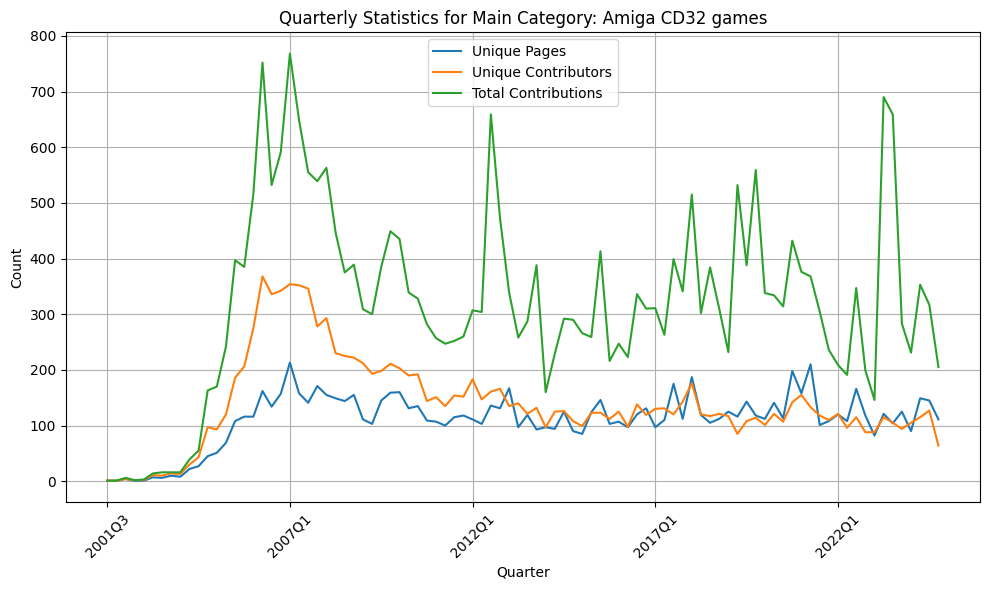
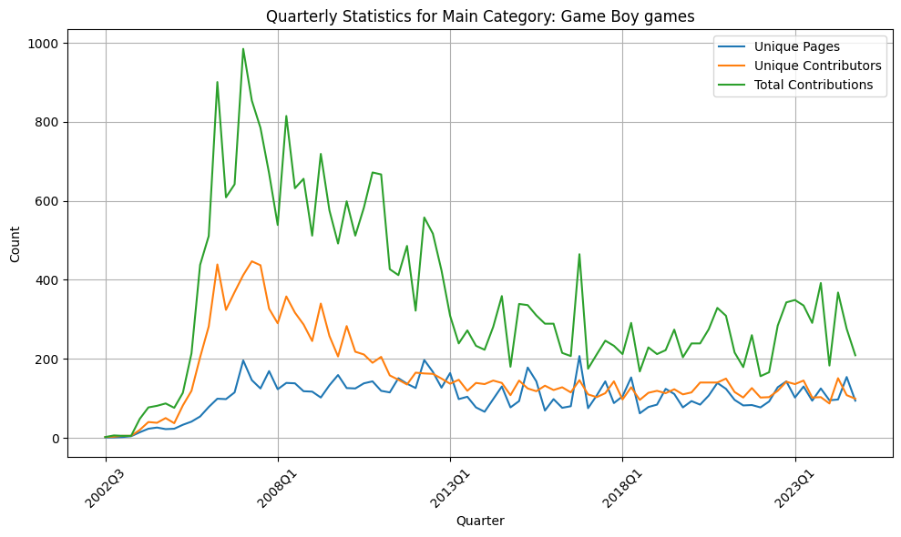
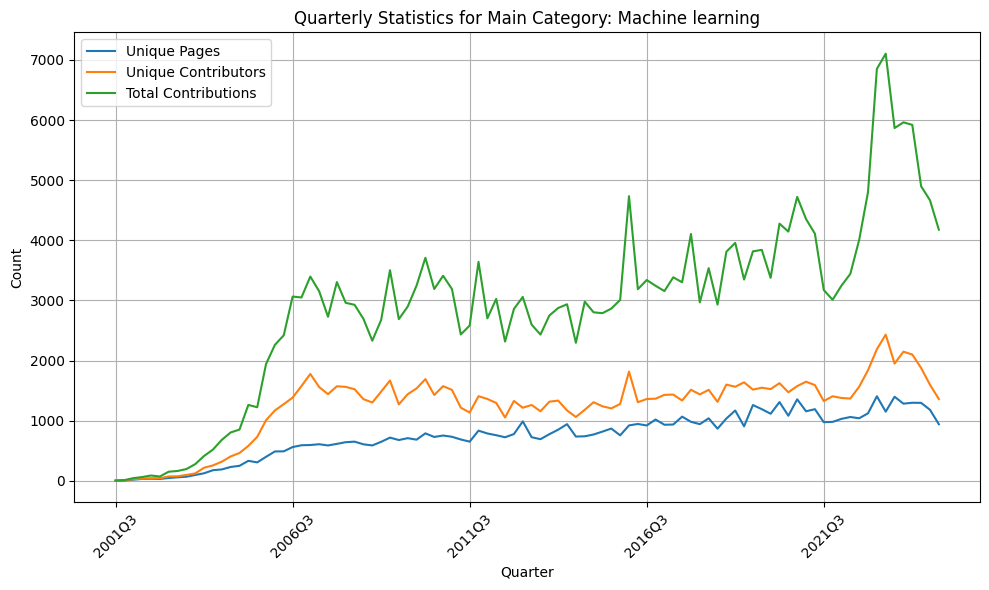
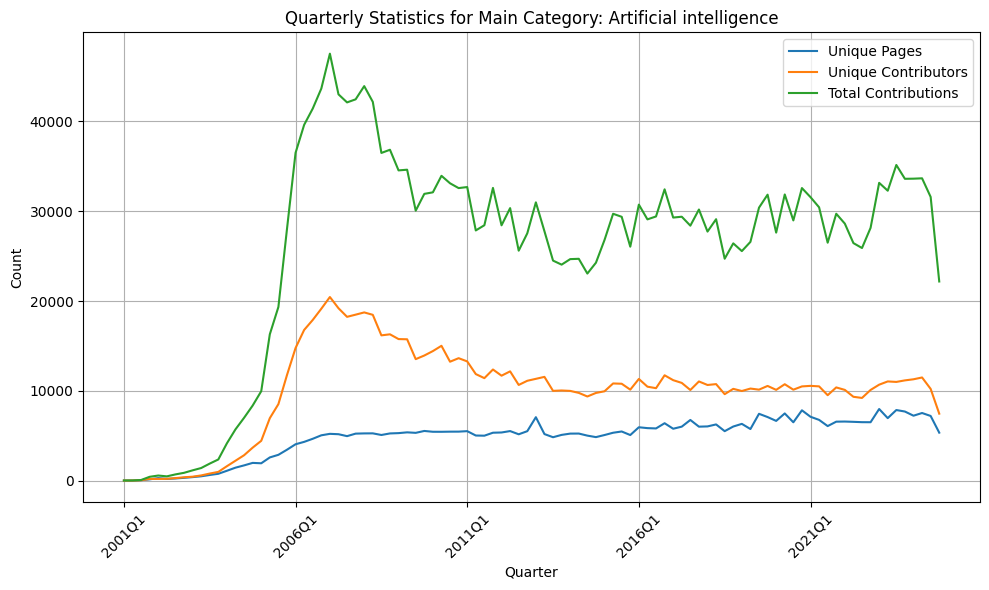
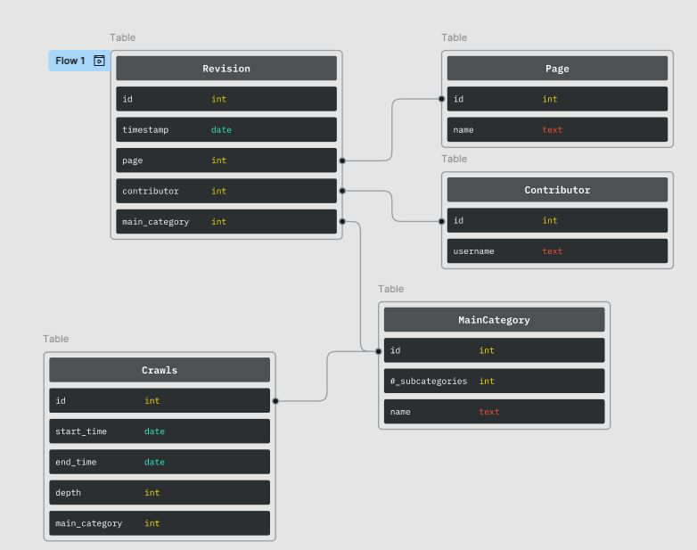

# Network Science Project

The original Jupyter notebook crawling the Wikipedia pages can be found at [notebookes/wiki-data-acquisition.ipynb](notebookes/wiki-data-acquisition.ipynb). I started refactoring the code, removing certain parts from the notebook and putting them in separate files. 

## Crawled Categories

The table below shows the main categories crawled and some key metrics for each main category. The following graphs show the evolution of some of these metrics over time for each category.

| Category                | Number of Subcategories | Number of Pages | Number of Contributors | Number of Revisions |
| ----------------------- | ----------------------- | --------------- | ---------------------- | ------------------- |
| Amiga CD32 games        | 2                       | 143             | 8013                   | 29370               |
| Game boy games          | 6                       | 167             | 8953                   | 30851               |
| Machine learning        | 61                      | 1548            | 75217                  | 273260              |
| Artificial intelligence | 109                     | 8695            | 610800                 | 29368               |

***Amiga CD32 games***

***Game boy games***

***Machine learning***

***Artificial intelligence***

## Contributor Graph Builder

The ContributorGraphBuilder class implemented in [src/data/contributor_graph_builder.py](src/data/contributor_graph_builder.py) creates a networkx graph based on the crawled data.

## GraphAnalyzer

The GraphAnalyzer class implemented in [src/data/graph_analyzer.py](src/data/graph_analyzer.py) provides some tools for basic graph analysis.The following features are currently implemented: 

- Plot Degree vs. Average Degree of neighbors
- Log-log plot of probability density
- Plot centralities: degree, betweenness, closeness, eigenvector
- Plot comparison of different centralities
- Plot comparison of real to randomized network for all centralities

## GraphCommunityAnalyzer

The GraphCommunityAnalyzer class implemented in [src/data/graph_community_analyzer.py]() provides some tools for basic community analysis. The following features are currently implemented: 

- Community detection with reedy modularity maximization
- Community detection with label propagation algorithm
- Comparison to randomized networks

## Implementation

### Database

The file [src/models/models.py](src/models/models.py) contains the models for the database entities. The following figure shows the relationships.

